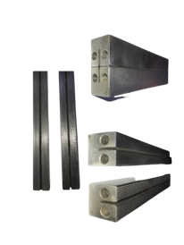

# 🚀 Flow-Pack Machine

The Flow-Pack Machine was successfully designed, implemented, and tested with a focus on mechanical, electrical, and control systems. Components were modeled in SolidWorks, CNC-machined, and assembled into mechanisms like conveyors and sealing units. The electrical system was optimized with proper power regulation, and the control system was built using a layered embedded C architecture (MCAL, HAL, APP). Once integrated, the machine achieved reliable, high-precision packaging performance.

---

## 📌 Table of Contents

1. [Project Overview](#project-overview)  
2. [How It Works - The Packaging Process](#how-it-works---the-packaging-process)  
3. [Mechanical Design & Materials](#mechanical-design--materials)  
4. [Electrical Components](#electrical-components)  
   - [Motors & Drivers](#motors--drivers)  
   - [Heaters](#heaters)  
5. [Embedded Control System](#embedded-control-system)  
   - [MCU1 & MCU2 Overview](#mcu1--mcu2-overview)  
   - [Pin Mapping](#pin-mapping)  
   - [UART Communication](#uart-communication)  
   - [Software Architecture](#software-architecture)  
   - [Modules (MCAL, HAL, APP)](#modules-mcal-hal-app)  
6. [Control Flow & Algorithms](#control-flow--algorithms)  
7. [Conclusion & Future Work](#conclusion--future-work)  
8. [Credits](#credits)

---

## 🧠 Project Overview

A fully automated packaging machine built with embedded control and mechatronics integration. The system wraps, seals, fills, and cuts packets using polypropylene film.

---

## 🔁 How It Works - The Packaging Process

1. The film roll is pulled and wrapped around the forming shoulder.  
2. Vertical heaters seal the sides.  
3. Horizontal heaters seal the bottom and top, then cut.  
4. The funnel fills the product.  
5. The conveyor shifts to start a new cycle.

---

## 🛠️ Mechanical Design & Materials

Designed using **SolidWorks** and manufactured with **CNC machining**.  

---

## 🔌 Electrical Components

### ⚙️ Motors & Drivers

- **DC Motors**: Used in heater movement and conveyor (24V, 200RPM, 2.35Nm)  
- **Stepper Motors**: For shrink film positioning  
- **Drivers**: Cytron MDD10A, L298N H-Bridge

### 🔥 Heaters

- 4 AC-powered heaters (130W, 220V)  
- 2 vertical + 2 horizontal  
- Used for sealing and cutting wrapped film

---

## 👨‍💻 Embedded Control System

#### 📟 MCU1 – User Interface & Command Controller

**Role:**  
MCU1 is responsible for handling all **user interactions** and managing the **control logic** between human inputs and machine operations.

**Responsibilities:**
- Reads input from:
  - **Industrial Start/Stop Button**
  - **Enter / Up / Down Buttons**
- Displays real-time data on **LCD (20x4)**:
  - Product count
  - Conveyor speed
- Sends configuration and command codes to MCU2 via **UART**
- Applies system logic to:
  - Start/stop machine
  - Configure production limit
  - Adjust speed settings

---

#### 🔧 MCU2 – Motor & Sensor Logic Controller

**Role:**  
MCU2 serves as the **execution engine** of the system, directly controlling all **motors, sensors, and actuators**.

**Responsibilities:**
- Receives UART commands from MCU1
- Controls:
  - **DC Motors** (Conveyor, Vertical, Horizontal)
  - **Stepper Motors** (Shrink wrap)
  - **Heaters**
- Monitors:
  - **Limit Switches** (Vertical & Horizontal sealing)
  - **Proximity Sensor** (Product detection)
- Sends product count feedback to MCU1

---

### 🧷 Pin Mapping

#### MCU1:
- LCD → PORTA & PORTB  
- Enter/Up/Down Buttons → PD3–PD5  
- Start Button → PD2

#### MCU2:
- Motors → PORTA & PORTB  
- Limit switches & sensors → PORTC  
- Stepper motors → PC0–PC3  
- Proximity sensor → PA7

  

---

### 🔄 UART Communication

MCUs communicate via UART protocol.

- **Baud Rate**: 9600  
- **Data Bits**: 8  
- **Stop Bits**: 1  
- **Parity**: None  
- **Bidirectional**: Yes

---

### 🧱 Software Architecture

---

### 🧩 Modules (MCAL, HAL, APP)

- **MCAL**: Handles direct hardware (timers, interrupts, UART)  
- **HAL**: Interfaces for LCD, buttons, motors, sensors  
- **APP**: Machine state logic, start/stop, speed control, counter logic

---

## 🔁 Control Flow & Algorithms

### 🔂 MCU1 Flow

- Displays welcome screen  
- Reads Enter button → allows speed and limit config  
- Starts/stops machine via Industrial button  
- Updates screen every 500ms  
- Sends user settings and control codes to MCU2

---

### 🔂 MCU2 Flow

- Waits for start signal from MCU1  
- Runs heating cycles (Vertical → Shrinking → Conveyor → Horizontal)  
- Uses sensors (proximity + limit) to sequence steps  
- Sends product count updates

---

## ✅ Conclusion & Future Work

### 🔚 Conclusion

- Designed in SolidWorks  
- CNC manufacturing  
- Powered by dual ATmega32 controllers  
- Modular layered firmware in C  
- Successfully tested — sealed and packaged products automatically

### 🔮 Future Work

- Optimize heater feedback with temperature sensors  
- Improve motor synchronization and speed  
- Implement HMI touchscreen  
- Reduce machine size & cost

---

## 🙌 Credits

**Made By:**  
Ahmed Mohamed, Ali Yehya, Felopateer Emad,
Abdallah Mohamed, Ahmed Osama, Islam Ahmed, & Mazen Said

Mechatronics Engineering — The Higher Institute of Engineering, 6th October City  
Graduation Year: 2023–2024

**Supervised By:**  
Prof. Faeka Khater  

---
